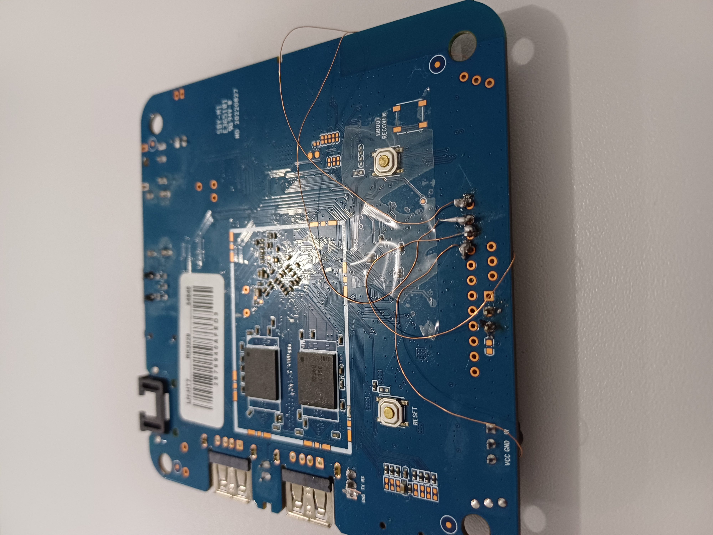

# In XPlus_GPIO
Refactoring the XPlus TVBOX to access the GPIO.


 


Ciência da Computação - Campus Cascavel


# Install the Armbian using the multitool
RK322x tvbox image: https://armbian.hosthatch.com/archive/rk322x-box/archive/

*In this test the Armbian_24.11_Rk322x-box_bookworm was used (Newer versions may also work)

# TVBox  In XPlus
Specs: SoC RK3229 (4 cores, ARM-V7), 2GB RAM, 8GB Flash)


# RK3229 GPIO 
The RK3229 features 4 GPIO controllers with 32 pins each (128 total). Many are used for  peripherals like flash, MMC, Wifi, HDMI etc. 
Based on the work developed in the  Instituto Federal de Goiás - Campus Goiânia by Mateus Morais Aguirre and Prof. Dr. Claudio Afonso Fleury, a search for IO ports was performed using the script  [testgpio.py](Examples/testgpio.py)).

Detected GPIO 

| GPIO          | Descrição     |
| ------------- | ------------- |
| 0   | GPIO0_A0/I2C0_SCL  |
| 1   | GPIO0_A1/I2C0_SDA  |
|41	| GPIO1_B1/UART1_TX/UART2_TX|
|42	| GPIO1_B2/UART1_RX/UART2_RX|
|96 |	GPIO3_A0/SDMMC1_CLKO |
|97 |	GPIO3_A1/SDMMC1_CMD |
|98 |	GPIO3_A2/SDMMC1_D0|
|99	|GPIO3_A3/SDMMC1_D1|
|100 |	GPIO3_A4/SDMMC1_D2|
|101 |	GPIO3_A4/SDMMC1_D2|
|102 |	GPIO3_A6/UART1_RTSN|
|103 |	GPIO3_A7/UART1_CTSN|

*Note: The MMC1 ports can be used because the board used only the MMC0 controller for the SD card slot. The pins placement in the board is presented below.


# Physical Access to GPIO Pins

- GPIO41 and GPIO42 have pre-drilled holes for easy soldering.

- Other GPIOs (e.g., 96 and 99) were accessed via enamel wires and unused holes.

- GND and 3.3V power pins are also identified on the board.





# Software
To access the GPIO(via sysfs):

`cd /sys/class/gpio`

`echo 41 > export`

`cd gpio41`

`echo out > direction`

`echo 0 > value`

`echo 1 > value`


## Blinka 
Blinka: Blinka brings CircuitPython APIs and, therefore, CircuitPython libraries to single board computers (SBCs). https://circuitpython.org/blinka
Popular in Raspberry, this library enables the GPIO access. It has also a set of components to access I2C devices.


Install the packages
```
apt install gcc
apt install python3-pip
apt install python3-venv
apt install python3-dev
apt install python3-libgpiod
apt install libgpiod2
apt install libgpiod-dev
update-alternatives --install /usr/bin/python python /usr/bin/python3 10
```

Create a python virtual environment
```
mkdir rk3229 && cd rk3229
python -m venv .env
source .env/bin/activate 
```
**At each start, execute  `source .env/bin/activate` **


Install the python packages
```
pip install click 
pip install adafruit-python-shell 
pip install adafruit_blinka 
pip install gpiod
```

*To install the packages outside a virtual environment, use the parameter `--break-system-packages` in the `pip` command. Ex: `pip install --break-system-packages`

### Led Blink 
Conection
GPIO42 -> LED -> RESISTOR 220 Ohm -> GND


Python code [blink.py](Examples/blink.py)

The blinka does not have the pin mapping for TVBox devices. We are using the RK3328, it has also 4 GPIO chips and 128 pins.

```
import os
os.environ["BLINKA_FORCEBOARD"]="ROC-RK3328-CC"
os.environ["BLINKA_FORCECHIP"]="RK3328"

import time
import board
import digitalio
from adafruit_blinka.microcontroller.generic_linux.libgpiod_pin import Pin
```

In the RK3229 datasheet, the ports codification follows the pattern:

GPIO(X1)_(X2)(X3)		

GPIO = 32 ∗ X1 + 8 ∗ X2 + X3.	

Values: A = 0, B = 1, C = 2 e D = 3.

Ex: 
```
GPIO1_B2
num= 32*1 + 1*8 + 2
num = 42
```
In the blinka, follows the pattern (chip, port). To use this codification, we just need to sum `8*X2 + X3`, and use as the second parameter. For instance, port 42 is instantiated as `pin = Pin((1,10))`

```
pin = Pin((1,10))  # (x,y) = 32*x + 10*y  -> 1*32 + 10 = 42 (GPIO 42)
led = digitalio.DigitalInOut(pin)
led.direction = digitalio.Direction.OUTPUT
```

Writing in the port 
```
while True:
    led.value = True
    time.sleep(0.5)
    led.value = False
    time.sleep(0.5)
```


Run 

`python blink.py`


### I2C connection
rk3229 has 4 I2C controllers. It was detected the controller 0, using the ports 0 (SCL) and 1 (SDA) (Figure above).

Enabling the I2C controller in DTB


```
cd /boot
dtc -I dtb -O dts dtb/rk322x-box.dtb > rk322x-box.dts
```

Edit the file rk3222x-box.dts  and enable I2C_0, changing disable for ok in the status field.

```
       i2c@11050000 {
                compatible = "rockchip,rk3228-i2c";
                reg = <0x11050000 0x1000>;
                interrupts = <0x00 0x24 0x04>;
                #address-cells = <0x01>;
                #size-cells = <0x00>;
                clock-names = "i2c";
                clocks = <0x02 0x14c>;
                pinctrl-names = "default";
                pinctrl-0 = <0x29>;
                status = "okay";
                phandle = <0x78>;
        };
```

generate the new DTB dtb/rk322x-box.dtb  

`dtc -I dts -O dtb rk322x-box.dts -o dtb/myrk3222x-box.dtb`

edit the file  /boot/armbianEnv.txt, field fdtfile

`fdtfile=myrk322x-box.dtb`

restart the board


To test, connect an I2C device in the SCL and SDA pins, and check if it will be find.

```
apt install i2c-tools
i2cdetect -y 0
```

Output example with an OLED (Address 0x3c) e BMP280 (Address 0x76)

```
(.env) root@rk322x-box:~/rk3229# i2cdetect -y 0
     0  1  2  3  4  5  6  7  8  9  a  b  c  d  e  f
00:                         -- -- -- -- -- -- -- --
10: -- -- -- -- -- -- -- -- -- -- -- -- -- -- -- --
20: -- -- -- -- -- -- -- -- -- -- -- -- -- -- -- --
30: -- -- -- -- -- -- -- -- -- -- -- -- 3c -- -- --
40: -- -- -- -- -- -- -- -- -- -- -- -- -- -- -- --
50: -- -- -- -- -- -- -- -- -- -- -- -- -- -- -- --
60: -- -- -- -- -- -- -- -- -- -- -- -- -- -- -- --
70: -- -- -- -- -- -- 76 --
```

- Edit the file board in Blinka, to use the correct I2C pin (TODO)
  
`cd .env/lib/python3.11/site-packages/adafruit_blinka/microcontroller/rockchip/rk3328/`

- Edit the file pin.py

```
# I2C
I2C0_SDA = GPIO0_A1
I2C0_SCL = GPIO0_A0
#I2C1_SDA = GPIO2_A4
#I2C1_SCL = GPIO2_A5


...
...
...

# ordered as i2cId, SCL, SDA
#i2cPorts = ((0, I2C1_SCL, I2C1_SDA),)
i2cPorts = ((0, I2C0_SCL, I2C0_SDA),)
```


### Install circuitpython-ssd1306 

OLED 

```
apt install libjpeg-dev
pip install pillow 
pip install adafruit-circuitpython-ssd1306 
```

To test, run the code [oled.py](Examples/oled.py)

`python oled.py`

### Install  circuitpython-bmp280
BMP280 - Pressure and temperature sensor

`pip install adafruit-circuitpython-bmp280`

To test, run the code [bmptest.py](Examples/bmptest.py)

`python bmptest.py`


- Example, reading the data from BMP280 and showing in the OLED display
 
Code [displaybmp.py](Examples/displaybmp.py)


### Sending data to Internet (Thingspeak)
Create a channel in the [Thingspeak](https://thingspeak.mathworks.com/) 

Code [displaybmp_thingspeak.py](Examples/displaybmp_thinkspeak.py)


### GPIO Input
Some RK3228 ports have  pull up or down resistors, that can be configured by software. Take a look in the datasheet, if the port to be used by the button can be configured. In case it is not possible, it will be necessary to use a  pull up ou pull down resistor.

Code [readpin.py](Examples/readpin.py)


```
import os
os.environ["BLINKA_FORCEBOARD"]="ROC-RK3328-CC"
os.environ["BLINKA_FORCECHIP"]="RK3328"
import time
import board
import digitalio
from adafruit_blinka.microcontroller.generic_linux.libgpiod_pin import Pin

pin = Pin((3,3))  ## Pin 99
pinled = Pin((1,10))  ## Pin 42

button = digitalio.DigitalInOut(pin)
button.direction = digitalio.Direction.INPUT
button.pull = digitalio.Pull.UP

led = digitalio.DigitalInOut(pinled)
led.direction = digitalio.Direction.OUTPUT

while True:
    led.value = button.value
    #print(button.value)
    time.sleep(0.1)
```

### Using the keypad component

```
import os

os.environ["BLINKA_FORCEBOARD"]="ROC-RK3328-CC"
os.environ["BLINKA_FORCECHIP"]="RK3328"

import time
import board
import digitalio
from adafruit_blinka.microcontroller.generic_linux.libgpiod_pin import Pin

import keypad
button=Pin((3,3)) #Pin 99
keys = keypad.Keys((button,), value_when_pressed=False, pull=True)

while True:
    event = keys.events.get()
    # event will be None if nothing has happened.
    if event:
        print(event)
``` 

# Hints
- Installing the GUI 

`apt install xfce lightdm xorg`

- GUI in python
  
There are many options. For instance [PySimpleGUI](https://www.pysimplegui.com/) 


`apt install python3-tk`

`pip install pysimplegui`


# NOT WORKING YET
The CircuitPython is working with the devices used in this tutorial. However, some sensor type uses a proprietary protocol. For instance, the DHT sensor uses a 1-wire proprietary protocol. The protocol requires a time sample in us (microseconds), which in the case of a time sharing OS like Linux, it is hard to guarantee. 

pip install adafruit-circuitpython-dht

In the tests performed, in most of cases the reading returns a error due to missing bits ([dht.py](Examples/dht.py)). Putting the scaling_governor in performance mode (maximum processor frequency), some readings were ok (about 10%). In this case the SoC performance is the problem.

```
cd /sys/devices/system/cpu/cpu1/cpufreq
echo performance > scaling_governor
```

Pinning the execution in the core 0x2

`taskset 0x2 python dht.py`


# TODO
- Create the board and chip for the TVBOX in Blinka, easing the pin mapping. It will be required to cbhange the code in the adafruit-platformdetector library.
- Try to optimize the DHT code (maybe using C)  
- Map the Arduino framework for the TVBox  


