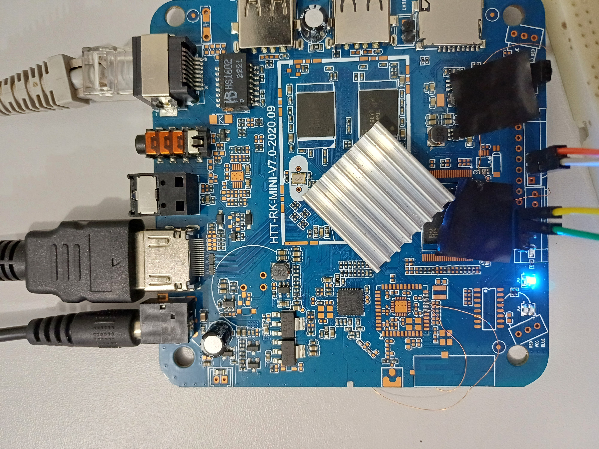

# In XPlus_GPIO
Refactoring the XPlus TVBOX to access the GPIO.
UNIOESTE - Campus Cascavel.

# Instalar o Armbian utilizando a ferramenta multitool
Imagem utilizada neste tutorial: https://armbian.hosthatch.com/archive/rk322x-box/archive/

*No teste foi utilizada a imagem Armbian_24.2.5_Rk322x-box_bookworm

# TVBox  In XPlus
Especificações: SoC RK3229 (4 cores, ARM-V7), 2GB RAM, 8GB Flash)


# RK3229 GPIO 
São 4 controladores GPIO totalizando 128 pinos. Alguns pinos tem utilização pre-definida para acessar dispositivos como flash, MMC, Wifi, HDMI etc. 
Baseado no trabalho do Instituto Federal de Goiás - Campus Goiânia, Aluno: Mateus Morais Aguirre, orientado pelo Prof. Dr. Claudio Afonso Fleury, uma busca por portas GPIO foi realizada (script [testgpio.py](Examples/testgpio.py)).

Para essa placa, foram identificados algumas portas disponíveis, conforme tabela a seguir 

| GPIO          | Descrição     |
| ------------- | ------------- |
| 0   | GPIO0_A0/I2C0_SCL  |
| 1   | GPIO0_A1/I2C0_SDA  |
|41	| GPIO1_B1/UART1_TX/UART2_TX|
|42	| GPIO1_B2/UART1_RX/UART2_RX|
|96 |	GPIO3_A0/SDMMC1_CLKO |
|97 |	GPIO3_A1/SDMMC1_CMD |
|98 |	GPIO3_A2/SDMMC1_D0|
|99	|GPIO3_A3/SDMMC1_D1|
|100 |	GPIO3_A4/SDMMC1_D2|
|101 |	GPIO3_A4/SDMMC1_D2|
|102 |	GPIO3_A6/UART1_RTSN|
|103 |	GPIO3_A7/UART1_CTSN|

*As portas MMC1 podem ser utilizadas pois a placa utiliza somente o MMC0 que é o slot de cartão SD. A localização de cada um dos pinos é apresentada na figura abaixo.


Para acessar o GPIO foram soldados fios esmaltados (utilizados para jumper). Os pinos GPIO 41 e 42 foram soldados diretamente pois a placa já contém os furos. Para facilitar o acesso as demais portas foram reutilizados furos existentes na placa, pois aparentemente não estão em uso (no PCB eles direcionam para um local com o diagrama de um chip, que não possui CI soldado).
Foi também identificado dois pinos GND e 3V3 para alimentação dos circuitos externos.



# Software
É possível fazer o acesso ao GPIO diretamente:

`cd /sys/class/gpio`

`echo 41 > export`

`cd gpio41`

`echo out > direction`

`echo 0 > value`

`echo 1 > value`


## Blinka 
Blinka: Blinka brings CircuitPython APIs and, therefore, CircuitPython libraries to single board computers (SBCs). https://circuitpython.org/blinka

Popular na Raspberry, possibilita o acesso nas portas GPIO. Possui também uma vasta biblioteca de acesso a placas via I2C.


Instalação de pacotes
```
apt install gcc
apt install python3-pip
apt install python3-venv
apt install python3-dev
apt install python3-libgpiod
apt install libgpiod2
apt install libgpiod-dev
update-alternatives --install /usr/bin/python python /usr/bin/python3 10
```

Criar um ambiente virtual python
```
mkdir rk3229 && cd rk3229
python -m venv .env
source .env/bin/activate 
```
**Nao esquecer de dar um `source .env/bin/activate` a cada inicialização da placa**


Instalar os pacotes python
```
pip install click 
pip install adafruit-python-shell 
pip install adafruit_blinka 
pip install gpiod
```

*Para fazer a instalação sem utilizar um ambiente virtual é necessário usar a opção `--break-system-packages` no comando `pip`. Ex: `pip install --break-system-packages`

### Led Blink 
Conexão
GPIO42 -> LED -> RESISTOR 220 Ohm -> GND


Código python [blink.py](Examples/blink.py)


O blinka não possui um mapeamento específico para o TVBOX. Está sendo utilizado o RK3328, que possui também 4 chips GPIO, totalizando os mesmos 128 pinos da RK3229 (é importante notar que a funcionalidade das portas entre RK3328 e RK3229 é diferente, mas nesse caso como é acesso direto a porta GPIO, pode ser feito sem problemas) 

```
import os
os.environ["BLINKA_FORCEBOARD"]="ROC-RK3328-CC"
os.environ["BLINKA_FORCECHIP"]="RK3328"

import time
import board
import digitalio
from adafruit_blinka.microcontroller.generic_linux.libgpiod_pin import Pin
```

Na documentação do RK3329 a codificação de portas segue a seguinte nomenclatura:

GPIO(X1)_(X2)(X3)		

Número do GPIO = 32 ∗ X1 + 8 ∗ X2 + X3.	

valores: A = 0, B = 1, C = 2 e D = 3.

Ex: 
```
GPIO1_B2
num= 32*1 + 1*8 + 2
num = 42
```
No blinka a codificação segue o padrão (chip, porta). Para transformar nessa codificação, basta apenas somar o `8*X2 + X3`, e usar no segundo parametro. Assim a porta 42 é instanciada assim `pin = Pin((1,10))`


```
pin = Pin((1,10))  # (x,y) = 32*x + 10*y  -> 1*32 + 10 = 42 (GPIO 42)
led = digitalio.DigitalInOut(pin)
led.direction = digitalio.Direction.OUTPUT
```

Escrevendo na porta
```
while True:
    led.value = True
    time.sleep(0.5)
    led.value = False
    time.sleep(0.5)
```


Para executar 

`python blink.py`


### Conexão i2c
O rk3229 possii 4 controladores I2C. Foi identificado os pinos do controlador 0, nas portas 0 (SCL), 1 (SDA) (ver figura acima).

Habilitando o controlador i2c no dtb

```
cd /boot
dtc -I dtb -O dts dtb/rk322x-box.dtb > rk322x-box.dts
```

Editar o arquivo rk3222x-box.dts e habilitar o controlador I2C_0, trocando o disable por okay no campo status.

```
       i2c@11050000 {
                compatible = "rockchip,rk3228-i2c";
                reg = <0x11050000 0x1000>;
                interrupts = <0x00 0x24 0x04>;
                #address-cells = <0x01>;
                #size-cells = <0x00>;
                clock-names = "i2c";
                clocks = <0x02 0x14c>;
                pinctrl-names = "default";
                pinctrl-0 = <0x29>;
                status = "okay";
                phandle = <0x78>;
        };
```

gerar o novo dtbdtb/rk322x-box.dtb  

`dtc -I dts -O dtb rk322x-box.dts -o dtb/myrk3222x-box.dtb`

editar o arquivo /boot/armbianEnv.txt, o campo fdtfile

`fdtfile=myrk322x-box.dtb`

reiniciar a placa


Conectar um dispositivo i2c no barramento e verificar se ele será encontrado

```
apt install i2c-tools
i2cdetect -y 0
```

Exemplo de saida para o display OLED (Endereco 0x3c) e BMP280 (0x76)

```
(.env) root@rk322x-box:~/rk3229# i2cdetect -y 0
     0  1  2  3  4  5  6  7  8  9  a  b  c  d  e  f
00:                         -- -- -- -- -- -- -- --
10: -- -- -- -- -- -- -- -- -- -- -- -- -- -- -- --
20: -- -- -- -- -- -- -- -- -- -- -- -- -- -- -- --
30: -- -- -- -- -- -- -- -- -- -- -- -- 3c -- -- --
40: -- -- -- -- -- -- -- -- -- -- -- -- -- -- -- --
50: -- -- -- -- -- -- -- -- -- -- -- -- -- -- -- --
60: -- -- -- -- -- -- -- -- -- -- -- -- -- -- -- --
70: -- -- -- -- -- -- 76 --
```

- Editar a board, para considerar os pinos I2C corretos (ver TODO)
  
`cd .env/lib/python3.11/site-packages/adafruit_blinka/microcontroller/rockchip/rk3328/`

- Editar o arquivo pin.py

```
# I2C
I2C0_SDA = GPIO0_A1
I2C0_SCL = GPIO0_A0
#I2C1_SDA = GPIO2_A4
#I2C1_SCL = GPIO2_A5


...
...
...

# ordered as i2cId, SCL, SDA
#i2cPorts = ((0, I2C1_SCL, I2C1_SDA),)
i2cPorts = ((0, I2C0_SCL, I2C0_SDA),)
```


### Instalar o circuitpython-ssd1306 

OLED 

```
apt install libjpeg-dev
pip install pillow 
pip install adafruit-circuitpython-ssd1306 
```

Para testar, utilize o código [oled.py](Examples/oled.py)

`python oled.py`

### Instalar o circuitpython-bmp280
BMP280 - Temperatura e pressão

`pip install adafruit-circuitpython-bmp280`

Para testar, utilize o código [bmptest.py](Examples/bmptest.py)

`python bmptest.py`


- Leitura dos dados do BMP e apresentando no display
- 
Código [displaybmp.py](Examples/displaybmp.py)


### Enviando dados para o Thinkspeak
Criar um canal no [Thinkspeak](https://thingspeak.mathworks.com/) 

Código [displaybmp_thinkspeak.py](Examples/displaybmp_thinkspeak.py)


# NOT WORKING YET
A biblioteca CircuitPython está funcionando para os dispositivos testados. No entanto, alguns sensores usam um protocolo bem especifico por exemplo o sensor de temperatura e umidade DHT que utiliza um protocolo de 1-wire próprio. O protocolo necessita de leitura na faixa dos us, o que em um sistema de tempo compartilhado como o Linux, nem sempre é possível garantir. 

pip install adafruit-circuitpython-dht

Nos testes realizados a maioria das vezes a leitura retorna um erro por falta de dados ([dht.py](Examples/dht.py)). Algumas leituras foram bem sucedidas (menos de 1%), mesmo colocando o scaling_governor no modo performance (frequência máxima de operação)] e "pinando" a execução em um núcleo específico. Isso sugere que o problema está no desempenho do SoC.

```
cd /sys/devices/system/cpu/cpu1/cpufreq
echo performance > scaling_governor
```

Executando no core 1

`taskset 0x2 python dht.py`


# TODO
- Criar o proprio board e chip para a TVBOX no Blinka, facilitando o mapeamento dos pinos e sem a necessidade de alterar o mapeamento de uma placa diferente. Vai necessitar alterar o código do pacote adafruit-platformdetector.
- Fazer testes com outros dispositivos como botões, interrupções, etc
- Melhorar o código do DHT (possivelmente utilizando a linguagem C)  
- Mapear o framework Arduino para a placa (vale a pena ) ?  


